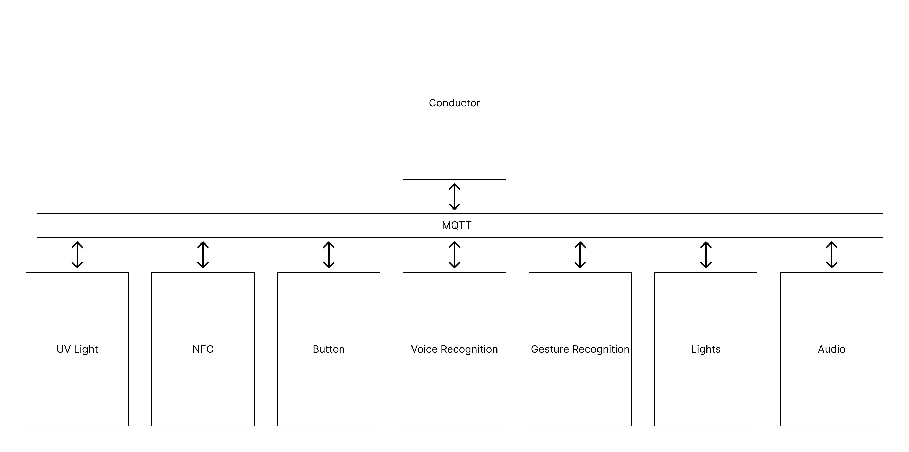

# The Good Wand #

This repository contains all software necessary for implementing the good wand on a Raspberry Pi 0W 2 running Raspberry Pi OS Lite

### Services ###

Services connect the technology behind the wand together via MQTT. [Click here for a detailed description of all services, and the MQTT API.](services/README.md)

### Templates ###

Templates provide a Python API that abstracts away the MQTT interface.

### Spells ###

Spells utilize the services to create games. [Click here for a detailed description of all spells](spells/README.md)

### Setup ###

Shell scripts are provided to install dependencies of the project. [Click here for more setup details](setup/README.md)

1. Clone repo
2. cd to setup folder
3. run ./install_all.sh (DO NOT RUN AS SUDO)
4. Monitor for errors

### Contribution guidelines ###

* No pushing directly to master. All changes are to be done on a feature branch and merged in with a PR.
